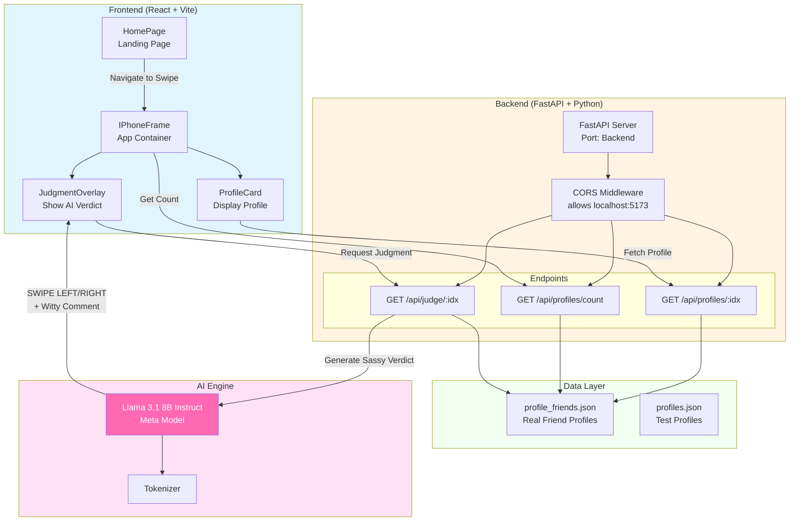

# BumDerHinge 🔥💔

**An AI-Powered Dating Profile Judge** - Where Llama 3.1 gives brutally honest, hilariously sassy verdicts on dating profiles.

## 🎯 Concept

BumDerHinge is a parody dating app that turns the tables on swiping. Instead of you judging profiles, an AI judge (powered by Meta's Llama 3.1 8B Instruct) evaluates dating profiles with witty, emoji-filled commentary and delivers a verdict: **SWIPE LEFT** or **SWIPE RIGHT**.

## ✨ Key Features

- **Profile Browsing**: Swipe through dating profiles (real friend profiles for testing)
- **AI-Powered Judgments**: Llama model evaluates profiles based on:
  - 🚩 **Red Flags**: One-dimensional personalities, gym bros, hopeless romantics, generic answers, unrealistic expectations
  - 🟢 **Green Flags**: Diverse interests, authenticity, genuine humor, unique traits, healthy expectations
  - 🎭 **Personality Depth**: Does this person have more layers than a kiddie pool?
- **Sassy Verdicts**: Get witty, cheeky AI commentary like:
  - "Gym = entire personality 🏋️😴"
  - "Actually interesting! Rare find ✨"
  - "Basic as pumpkin spice latte 🎃"
  - "Romance level: Nicholas Sparks fanfic energy 📚✨"

## 🏗️ Architecture


<!--  -->


## 🛠️ Tech Stack

### Frontend
- **React** - UI library
- **Vite** - Build tool and dev server
- **React Router** - Navigation
- **Bootstrap** - Styling

### Backend
- **FastAPI** - Python web framework
- **Uvicorn** - ASGI server
- **Transformers** - HuggingFace library for AI models
- **PyTorch** - Deep learning framework

### AI Model
- **Meta Llama 3.1 8B Instruct** - Large language model for profile evaluation

## 📋 API Endpoints

- `GET /api/profiles/count` - Get total number of profiles
- `GET /api/profiles/:idx` - Get profile by index
- `GET /api/profiles/id/:profile_id` - Get profile by ID
- `GET /api/judge/:idx` - Get AI judgment for a profile

## 🚀 Setup & Installation

### Prerequisites
- Python 3.8+
- Node.js 16+
- npm or yarn
- HuggingFace account (for model access)

### Backend Setup

```bash
cd backend
pip install -r requirements.txt
uvicorn main:app --reload
```

The backend will start on `http://localhost:8000`

### Frontend Setup

```bash
cd frontend/dating-frontend
npm install
npm run dev
```

The frontend will start on `http://localhost:5173`

## 🎮 Usage

1. Start both backend and frontend servers
2. Navigate to `http://localhost:5173`
3. Click to enter the swipe interface
4. Browse through profiles
5. Click on a profile to get the AI's sassy judgment
6. Enjoy the witty commentary! 😄

## 📁 Project Structure

```
BumDerHinge/
├── backend/
│   ├── main.py                 # FastAPI application
│   ├── profiles.json           # Test profiles
│   ├── profile_friends.json    # Real friend profiles
│   └── requirements.txt        # Python dependencies
├── frontend/
│   └── dating-frontend/
│       ├── src/
│       │   ├── App.jsx         # Main app component
│       │   ├── components/
│       │   │   ├── HomePage.jsx        # Landing page
│       │   │   ├── IPhoneFrame.jsx     # App container
│       │   │   ├── ProfileCard.jsx     # Profile display
│       │   │   └── JudgmentOverlay.jsx # AI verdict overlay
│       │   └── assets/         # Images and static files
│       └── package.json        # Node dependencies
└── README.md
```

## 🎭 User Flow

1. **Landing Page** → User sees the homepage
2. **Navigate to Swipe** → Enter the dating app interface
3. **Browse Profiles** → See dating profile details with emojis
4. **Request Judgment** → Click to get AI analysis
5. **Get Verdict** → See "SWIPE LEFT/RIGHT" with witty comment
6. **Next Profile** → Continue swiping through more profiles

## 🤖 AI Judgment Criteria

The AI evaluates profiles based on:

### Red Flags 🚩
- One-dimensional personality (only gym, only work)
- Boring/generic answers
- Too romantic/desperate
- Unrealistic expectations
- Vague or empty responses
- Trying too hard to be funny

### Green Flags 🟢
- Diverse interests showing depth
- Genuine personality and authenticity
- Good sense of humor
- Unique and thoughtful answers
- Healthy relationship expectations
- Good moral compass

## 📝 License

See [LICENSE](LICENSE) file for details.

## 🙏 Acknowledgments

- Meta AI for Llama 3.1 model
- HuggingFace for model hosting and transformers library
- All the friends who let their profiles be judged by AI 😄
